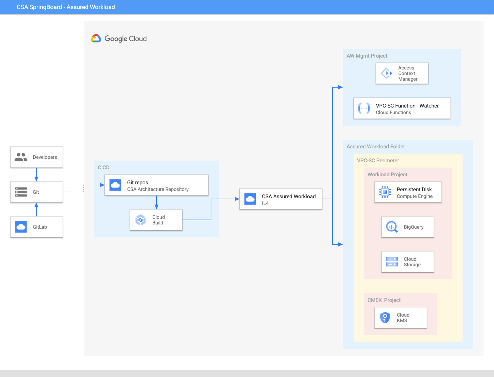

```
This is not an officially supported Google product.
This code creates PoC demo environment for CSA IL4 Assured Workload with VPC service perimeter. This demo code is not built for production workload. 
```

# CSA Guide
This Cloud Security Architecture uses terraform to setup IL4 Assured Workload with VPC service perimeter demo in a parent folder and underlying infrastructure using Google Cloud Services like [Asssured Workload](https://cloud.google.com/assured-workloads), [Cloud Function](https://cloud.google.com/functions), [Access Context Manager](https://cloud.google.com/access-context-manager), [Cloud Key Management](https://cloud.google.com/security-key-management), [Compute Engine](https://cloud.google.com/compute), [BigQuery](https://cloud.google.com/bigquery), [Compute Storage](https://cloud.google.com/storage)  and [Cloud Logging](https://cloud.google.com/logging).


## CSA Architecture Diagram
The image below describes the architecture of IL4 Assured Workload with VPC service perimeter.




## What resources are created?
Main resources:
- A parent folder for the PoC demo
- A management folder to manage assured workload APIs and VPC-SC perimeter
- IL4 Assured Workload
- One sub-project for the workload (Compute, Storage and BigQuery)
- One sub-project for KMS key


## How to deploy?
The following steps should be executed in Cloud Shell in the Google Cloud Console. 

### 1. Get the code
Clone this github repository go to the root of the repository.

``` 
git clone http://github.com/googlecloudplatform/csa-il4-assured-workload
cd csa-il4-assured-workload
```

### 3. Deploy the infrastructure using Terraform

From the csa-il4-assured-workload folder navigate to variable.tf file and update variables organization_id, billing_account and members for access in assured workload:

```
organization_id = “XXXXXXXXXXX”
billing_account = “XXXX-XXXXXX-XXXXX”
Members = [“user:name@domain.com”]
```


To find your  organization id and billing_id, run the following command: 
```
gcloud projects get-ancestors [ANY_PROJECT_ID_IN_ORG]
gcloud alpha billing accounts list
```

While in the csa-il4-assured-workload, run the commands below in order. When prompted for confirmation enter “yes” to proceed.
```
terraform init
terraform apply -target=data.google_projects.in_perimeter_folder
terraform apply
```
If prompted, authorize the API call.

**Note:** All the other variables are give a default value. If you wish to change, update the corresponding variables in variable.tf file.


## How to clean-up?

From the root folder of this repo, run the following command:
```
terraform destroy
```


