```
This is not an officially supported Google product.
This code creates PoC demo environment for CSA IL4 Assured Workload with VPC service perimeter. This demo code is not built for production workload. 
```

# Deploying IL4 Assured Workloads Architecture Guide

# Summary

Assured Workloads helps you comply with different regulatory compliance frameworks by implementing logical controls that segment networks and users from in-scope sensitive data. Many of the US compliance frameworks are built upon NIST SP 800-53 Rev. 5, but add on controls based on the sensitivity of the information and the framework's governing body. For customers who must comply with Department of Defense (DoD) Impact Level 4 ("IL4"), we recommend that you use [VPC Service Controls (VPC-SC)](https://cloud.google.com/vpc-service-controls/docs/overview) to create a strong boundary around the regulated environment.

This guide will provide written instructions and Terraform/Python code for:

1. Creating an Assured Workloads folder for an IL4 compliance framework
1. Setting up a VPC-SC perimeter around the Assured Workloads IL4 boundary
1. Adding new projects to the VPC-SC perimeter, both manually and via automation
1. Setting up Access Context Manager policy to enforce data residency controls for developers

# Architecture 

## Design Diagram

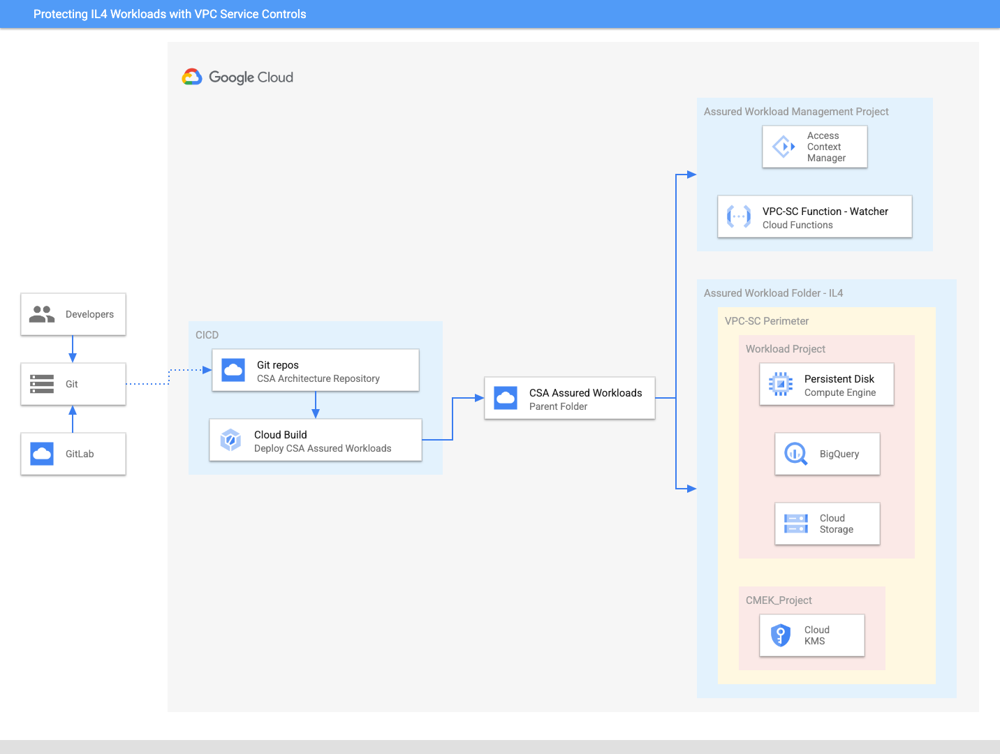

## Product and services

[Assured Workloads](https://cloud.google.com/assured-workloads) provides Google Cloud customers with the ability to apply security controls to an environment  in support of compliance requirements without compromising the quality of their cloud experience. The United States' DoD Defense Information Systems Agency (DISA) uses an IL classification system to classify data and authorize cloud environments. IL4 is among the highest level of authorization granted to environments storing and processing Controlled Unclassified Information (CUI), mission-critical information, and national security systems information. Assured Workloads supports workloads requiring IL4 compliance by adding guardrails that ensure customers:

1. May only use GCP services  granted IL4 Provisional Authorization by the DoD
1. Store and process data in [US-only regions](https://cloud.google.com/assured-workloads/docs/locations#us_regions)
1. Receive support from IL4-adjudicated first- and second-level staff who are US Persons located in the US

[VPC Service Controls](https://cloud.google.com/vpc-service-controls) (VPC-SC) provides an extra layer of security defense for Google Cloud services that is independent of [Identity and Access Management (IAM)](https://cloud.google.com/iam/docs/). While Identity and Access Management enables granular identity-based access control, VPC-SC enables broader context-based perimeter security, such as controlling data ingress and egress across the perimeter. VPC-SC adds a logical boundary around Google Cloud APIs that are managed at the organization level and applied and enforced at the project level. 

Before proceeding with this guide, you should:

-  Ensure that you've read and understand the [purpose and usage of VPC-SC](https://cloud.google.com/vpc-service-controls/docs/overview) and its [service perimeters](https://cloud.google.com/vpc-service-controls/docs/service-perimeters).
-  Ensure that the Google Cloud services you are planning to use are [in scope for IL4](https://cloud.google.com/assured-workloads/docs/supported-products) **and** are supported by [VPC-SC](https://cloud.google.com/vpc-service-controls/docs/supported-products).

## Design considerations

Because VPC-SC protection affects cloud services functionality, we recommend that you plan the enablement of VPC-SC in advance, and consider VPC Service Controls during architecture design. It's important to keep VPC-SC design as simple as possible. We recommend that you avoid perimeter designs that use multiple bridges, perimeter network projects or a DMZ perimeter, and complex access levels. Read more about designing and architecting service perimeters [here](https://cloud.google.com/vpc-service-controls/docs/architect-perimeters).

Assured Workloads folders modify Google Cloud's inherent global infrastructure to deliver products and services with IL4 compliance requirements by adjusting Google Cloud products' global behavior and access paths. This includes disabling global APIs, including the products' underlying dependencies, to provide data residency in alignment with IL4 requirements. Customers are still responsible for configuring IAM permissions, networking, and GCP services to meet IL4 compliance. Before deploying an IL4 Assured Workload, we recommend you familiarize yourself with IL4 requirements for these levels. 

## Prerequisites

### Assured Workloads

Before proceeding, it is important to understand that IL4 is a [Premium Platform Control.](https://cloud.google.com/assured-workloads/docs/concept-platform-controls#premium_tier) Platform Controls are a combination of Google Cloud infrastructure data location and personnel access primitives that support compliance by enforcing and restricting access by customers or Google personnel. To launch a Premium Platform Control, you must:

-  Ensure you have [Enhanced or Premium Support ](https://cloud.google.com/support)
-  [Enable Access Transparency](https://cloud.google.com/cloud-provider-access-management/access-transparency/docs/enable)

If you wish to use Assured Workloads [Premium Platform Controls](https://cloud.google.com/assured-workloads/docs/concept-platform-controls#premium_tier) but don't currently have a Premium subscription, sign up for a 60-day [Premium Free Trial](https://inthecloud.withgoogle.com/assured-workloads-60-day-trial-interest/sign-up.html?_gl=1*1q0ww8q*_ga*MTk5NjYyOTEzMi4xNjc5NDMzMTky*_ga_WH2QY8WWF5*MTY3OTUwODI5OC40LjEuMTY3OTUwODMyNy4wLjAuMA..&_ga=2.182814626.58027757.1679433192-1996629132.1679433192). 

Many Google Cloud services send out notifications to share important information with Google Cloud users. With [Essential Contacts](https://cloud.google.com/resource-manager/docs/managing-notification-contacts), you can customize who receives notifications by providing your own list of contacts. This is important because different individuals and teams within your organization care about different types of notifications. To reduce the impact of personnel changes, we recommend adding groups as contacts, then managing the membership of those groups to determine who receives notifications. This practice helps ensure that notifications always go to active employees.

1. Enable the [Essential Contacts API](https://console.cloud.google.com/flows/enableapi?apiid=essentialcontacts.googleapis.com&_ga=2.178924196.1685767107.1678727190-215554569.1678472440)
1. Visit the [Essential Contacts page](https://console.cloud.google.com/iam-admin/essential-contacts?_ga=2.217834006.1685767107.1678727190-215554569.1678472440)
1. Ensure the Google Cloud Organization is selected
1. [Add an Essential Contact](https://cloud.google.com/resource-manager/docs/managing-notification-contacts#add) for **Legal**

We recommend adding three Contacts for the Legal category: representatives from your Legal, Compliance, and Security departments. **This group will receive notifications of compliance violations**, so this will ensure that Legal and Compliance remain informed, and acts as an immediate notification to Security for remediation actions. We also recommend that you enact a plan of action for addressing these alerts.

### VPC Service Controls

-  Read about[ configuring service perimeters](https://cloud.google.com/vpc-service-controls/docs/service-perimeters).
-  Read about [management of VPC networks in service perimeters](https://cloud.google.com/vpc-service-controls/docs/vpc-perimeters-management).
-  Read about [granting access to VPC Service Controls](https://cloud.google.com/vpc-service-controls/docs/access-control).
-  If you want to configure external access to your protected services when you create your perimeter, [first create one or more access levels](https://cloud.google.com/access-context-manager/docs/create-access-level) before you create the perimeter.

# Deployment

## Terraform Deployment Instructions

1. Sign in to your organization and assign yourself the following roles:

1. Access Transparency Admin: roles/axt.admin
1. Assured Workloads Admin: roles/assuredworkloads.admin
1. Resource Manager Organization Viewer: roles/resourcemanager.organizationViewer
1. VPC Service Controls: roles/accesscontextmanager.policyAdmin
1. Create Log Sinks: roles/logging.configWriter

The following steps should be executed in Cloud Shell in the Google Cloud Console.

1. To deploy the architecture open up Cloud shell and clone the [git repository](https://github.com/mgaur10/csa-il4-assured-workload) using the command below.

```
git clone https://github.com/GCP-Architecture-Guides/csa-il4-assured-workload.git
```

1. Navigate to the csa-il4-assured-workload folder.

```
cd csa-il4-assured-workload
```

1. In the csa-il4-assured-workload folder navigate to variable.tf file and update variables organization_id, billing_account and members for access in assured workload.

```
organization_id = "XXXXXXXXXXX"

billing_account = "XXXX-XXXXXX-XXXXX"

Members = ["user:name@domain.com"]
```

> Note: All the other variables are given a default value. If you wish to change, update the corresponding variables in the variable.tf file.

1. To find your organization id and billing_id, run the following command.

```
gcloud projects get-ancestors [ANY_PROJECT_ID_IN_ORG]

gcloud alpha billing accounts list
```

1. While in the csa-il4-assured-workload, run the commands below in order. When prompted for confirmation enter "yes" to proceed.

```
terraform init

terraform apply -target=data.google_projects.in_perimeter_folder

terraform apply
```

> If prompted, authorize the API call.

1. Once deployment is finished it will publish the output summary of assets orchestrated. It deploys the resources within 10 minutes.

1.  After completing the demo, navigate to the csa-il4-assured-workload folder and run the command below to destroy all resources.

```
 terraform destroy
 ```

# Best Practices

We recommend you familiarize yourself with Google Cloud's recommended process to configure and enforce VPC-SC protection in your Google Cloud organization [by reading this document.](https://cloud.google.com/vpc-service-controls/docs/enable) Careless enablement of VPC-SC can cause problems with existing applications and can cause an outage. 

We also strongly recommend that you do not nest an Assured Workloads folder within another Assured Workloads folder - even if they are the same compliance framework - as this will cause errors. You can, however, nest Assured Workloads folders and non-Assured Workloads folders with each other.

We also recommend you set up logging and alerts for any changes to the Assured Workloads folder or according IAM permissions, including Org Admin changes. These alerts should be routed to an appropriate stakeholder other than Org Admin. This is because Org Admin can change the org level policies that are important for continuing compliance.

# Operations

## Logging

Access Transparency is a part of Google's long-term commitment to transparency and user trust. Access Transparency logs record the actions that Google personnel take when accessing customer content.

Access Transparency logs give you different information than Cloud Audit Logs. Cloud Audit Logs record the actions that members of your Google Cloud organization have taken in your Google Cloud resources, whereas Access Transparency logs record the actions taken by Google personnel. Google personnel are strictly restricted in what is visible to them. All access to customer content requires a valid justification. See [Justification Reason Codes](https://cloud.google.com/assured-workloads/access-transparency/docs/reading-logs#justification_reason_codes) for the list of valid business justifications.

Access Transparency log entries include details such as the affected resource and action, the time of the action, the reason for the action, and information about the accessor. For the list of Google services that provide Access Transparency logs, see [Google services with Access Transparency logs](https://cloud.google.com/assured-workloads/access-transparency/docs/supported-services).

## Monitoring, Alerting, and Reporting

### Querying Access Transparency Logs

Since Access Transparency logs are sent to Cloud Logging, we'll need to go to the Logs Explorer and build queries using the Logging Query Language. Overall, there are two ways to query for Access Transparency logs:

Project Level

```
logName="projects/PROJECT-ID/logs/cloudaudit.googleapis.com%2Faccess_transparency"
```

Organization Level

```
logName="organizations/ORG-ID/logs/cloudaudit.googleapis.com%2Faccess_transparency"
```

This generates all of the Access Transparency logs within the time period specified in the query. Now, if you want the good stuff, the specific types of Access Transparency logs, add the specific reason type. For example, a query for the Access Transparency logs generated because of third-party data requests look like so:

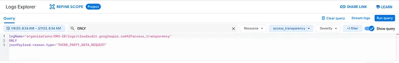

```
logName="organizations/ORG-ID/logs/cloudaudit.googleapis.com%2Faccess_transparency"
```

You can also exclude certain types of reasons. So, for example, if you're looking for every type of log EXCEPT FOR third-party data requests, use the following query:

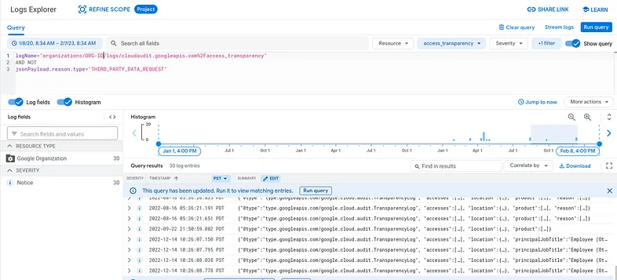


```
logName="organizations/ORG-ID/logs/cloudaudit.googleapis.com%2Faccess_transparency"

AND NOT

jsonPayload.reason.type="THIRD_PARTY_DATA_REQUEST"
```

Querying Access Transparency logs with these levels of specificity is particularly useful for Security Operations Centers whose response to the event can vary based on the reason code. 

### Org Policy Change Notifications

Ensure any changes to your Assured Workloads Org Policies generate alerts that are pushed to your preferred notification channel

#### Prerequisites 

##### Logging Project

Before starting, please ensure that you have a centralized logging project. If you don't already have one and need to create a logging project within your Assured Workloads folder, [please create one before proceeding.](https://cloud.google.com/logging/docs/central-log-storage)

For the purposes of this guide, I've created a project and named it "IL4-Logging Project"

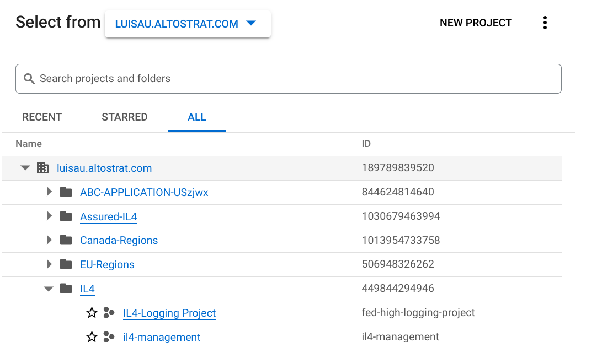

##### Log Bucket

Within your logging project, [create a log bucket](https://cloud.google.com/logging/docs/buckets#create_bucket). I've named my bucket "folder-logs" and selected "US" as the region:

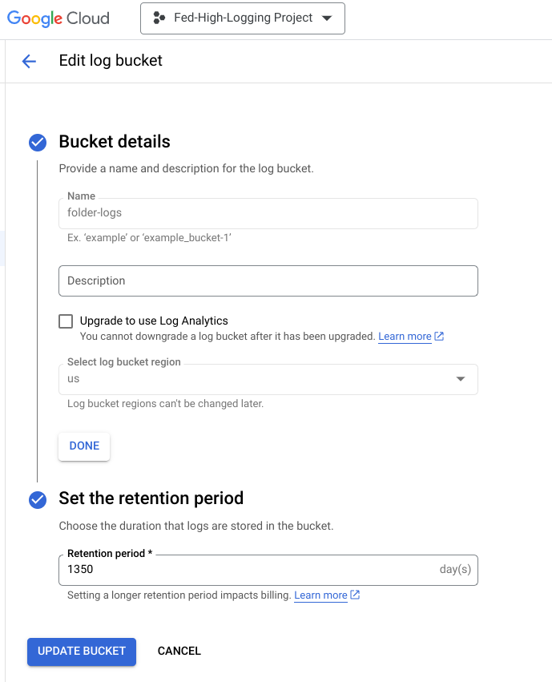

##### Note the Log Bucket Path

Take a note of your project name, the bucket location, and the bucket name as later on we will use the following path: 

```
logging.googleapis.com/projects/locations//buckets/
```

Based on my project ID, bucket location, and bucket name, my path will be:  
 

```
logging.googleapis.com/projects/il4-logging-project/locations/us/buckets/folder-logs
```

#### Querying Org Policy Changes

Customers can query all policy changes affecting their Assured Workloads folder by including the following query in the [Cloud Logging Explorer](https://console.cloud.google.com/logs/query?_ga=2.187681323.2041618581.1680814991-1422847751.1680725155): 

```
protoPayload.request.@type="type.googleapis.com/google.cloud.orgpolicy.v1.SetOrgPolicyRequest"

OR

protoPayload.request.@type="type.googleapis.com/google.cloud.orgpolicy.v1.clearOrgPolicyRequest"

OR

protoPayload.methodName="google.cloud.orgpolicy.v2.OrgPolicy.UpdatePolicy"

OR

protoPayload.methodName="google.cloud.orgpolicy.v2.OrgPolicy.DeletePolicy"
```

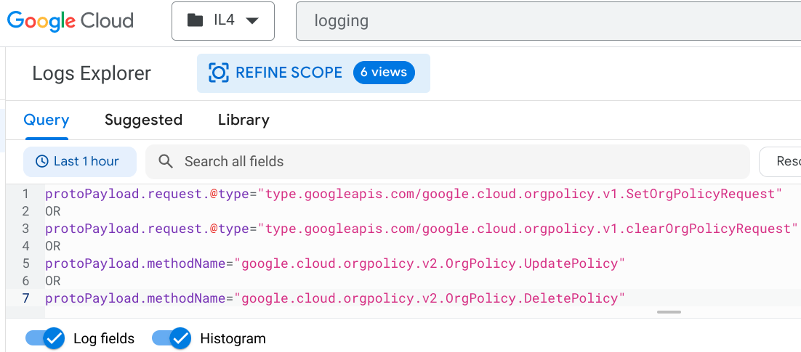

Notice that I am logged in at the Folder level (as indicated by the "IL4" selection next to the Google Cloud logo). If you are not conducting this query under the folder itself, you won't be able to see any results. 

##### Pushing Folder Logs to the Logging Project

1. Create a Log Sink based on this query - you can do so by clicking on "More Actions" and then "Create sink"

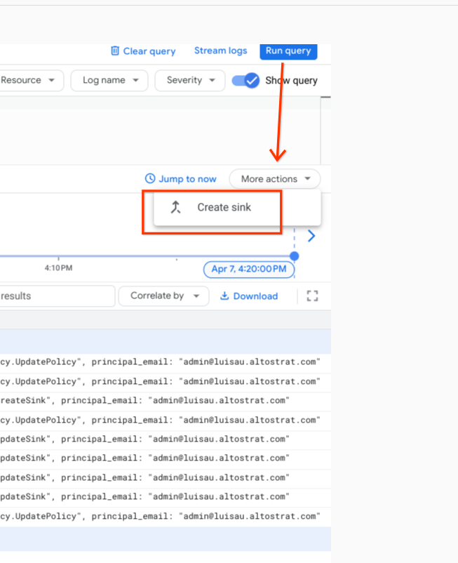

You should now be on a page named "Create logs routing sink". 

1. Add your sink name, a description, and click "Next". 

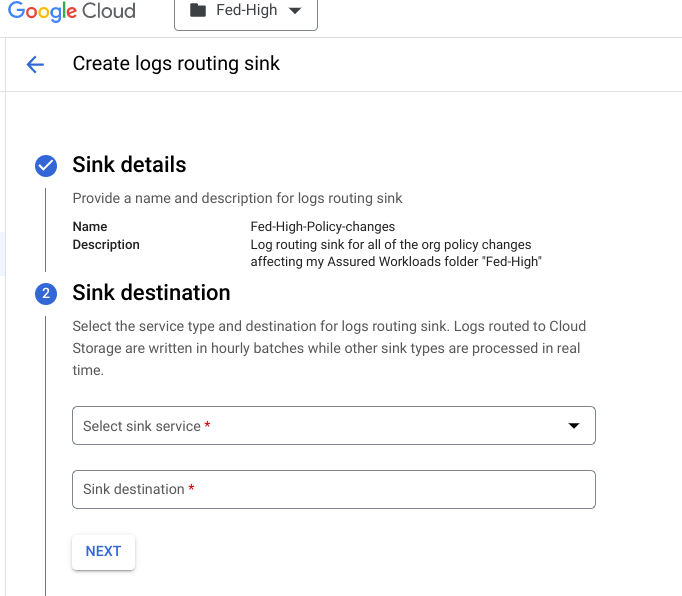

1. For the sink service, select "Logging Bucket". Include the bucket path from the [Note the Log Bucket Path](#heading=h.n54ul69qznbx) section. Click "Next".

1. Choose the logs to include in the sink. I chose to "Include only logs ingested by this folder".

1. Click "Done" and "Create Sink".

##### Verify the Sink Works

After a few minutes your folder logs should be visible in your logging project's log explorer. 

1. Click on "Refine Scope" 

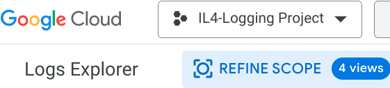

1. Select "Scope by storage" and select all of the options. Note that this includes the log bucket we previously created - "FOLDER-LOGS" in the screenshot below. Click "Apply".

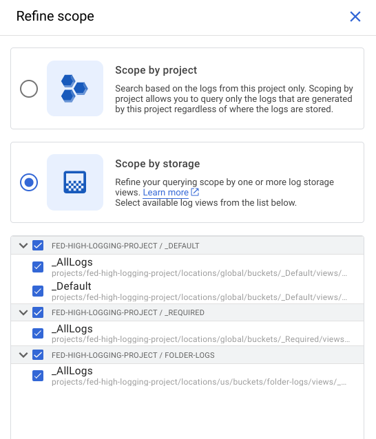

1. You can then run a query - for completeness, I suggest running the same query in the first screenshot of the [Querying Org Policy Changes](#heading=h.g03vo6cvme8s) section.  

#### Generating Alerts

Now that we have all of our logs in a central place, we can create alerts to receive notifications of any org policy changes affecting our Assured Workloads folders. 

1. Click "Create Alert" 

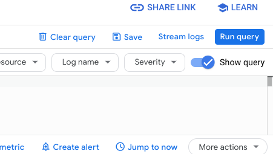

1. Add your Alert Details and click next
1. Step 2 - Choose logs to include in the alert - should already have the query. If not, recreate it: "folders/FOLDER_ID/policies". Then click next.
1. Define the notification frequency and autoclose duration
1. Add notification channels.
1. Click save

Check out [Configuring Log-Based Alerts](https://cloud.google.com/logging/docs/alerting/log-based-alerts) as configuring alerts based on particular log entries can help SOC teams engage the appropriate personnel in the incident response process. [Manage incidents for log-based alerts](https://cloud.google.com/logging/docs/alerting/log-based-incidents) can also assist in completing this cycle.

# Governance, Risk Management, and Compliance

## Discover Compliance Violations

Assured Workloads monitors a compliance framework's [organization policy constraints](https://cloud.google.com/resource-manager/docs/organization-policy/org-policy-constraints), and highlights a violation if a change to a resource is non-compliant. You can then resolve these violations, or create exceptions for them where appropriate.

Monitor the organization policy constraints, and highlight violations if a change to a resource is non-compliant. Violations may be viewed by navigating to the Assured Workloads [Monitoring page](https://console.cloud.google.com/compliance/monitoring?_ga=2.26184249.524481087.1680725155-1422847751.1680725155) and clicking the **Violation ID **to view the status of your compliance violations

Act and remediate these violations by following the remediation steps in the **Violation Details. **Please visit this [page](https://cloud.google.com/assured-workloads/docs/monitor-folder#monitored_violations) for the complete list of Monitored Violations. 

## Exceptions to the Restrict Resource Usage Organization Policy

We recommend maintaining Organization Policy Restrictions in place, as they help restrict access to unauthorized services and regions. However, you may selectively disable restrictions that prevent the usage of resources that aren't compliant with certain  compliance frameworks. **This is not recommended because it makes the Assured Workloads folder less restrictive and puts your environment in non-compliant scope**. However, it is available to customers who accept the risk of using non-compliant products. Customers may proceed with this by:

-  Having the appropriate IAM roles:
    -  Org Policy Administrator: roles/orgpolicy.policyAdmin
    -  Assured Workloads Admin: roles/assuredworkloads.admin

-  Modifying the policy based on [these instructions](https://cloud.google.com/resource-manager/docs/organization-policy/restricting-resources#setting_the_organization_policy)
-  [Adding an Assured Workloads Monitoring Violation Exception](https://cloud.google.com/assured-workloads/docs/monitor-folder#exception) to ensure the change has a documented business justification and isn't reported as "Unresolved" 

For an introduction on Organization Policy Restrictions, please [watch this video](https://www.youtube.com/watch?v=VX7444hVsD0). For more information on Restriction Resource Usage for Assured Workloads, including limitations, please read this [guide](https://cloud.google.com/assured-workloads/docs/restrict-resource-usage).

## Restrict TLS Versions

Google Cloud supports multiple TLS protocol versions. To meet compliance requirements, you may want to deny handshake requests from clients that use older TLS versions.

-  Ensure you have the appropriate IAM role:
    -  Org Policy Administrator: roles/orgpolicy.policyAdmin

-  Follow this [guide to restrict certain TLS versions ](https://cloud.google.com/assured-workloads/docs/restrict-tls-versions#restrict)

# Cost

<table>
  <thead>
    <tr>
      <th><strong>GCP Service</strong></th>
      <th><strong>Type</strong></th>
      <th><strong>Total Cost  USD </strong></th>
    </tr>
  </thead>
  <tbody>
    <tr>
      <td>Assured Workloads </td>
      <td>Premium Subscription, IL4</td>
      <td>20% uplift based on spend within the Assured Workloads folder</td>
    </tr>
    <tr>
      <td>VPC Service Controls</td>
      <td></td>
      <td>Free</td>
    </tr>
  </tbody>
</table>

The cost estimate may change with time and may vary per region, please review the cost of each resource at [Google Cloud Pricing Calculator](https://cloud.google.com/products/calculator).

# Related Resources

-  [Assured Workloads Quick Start Guide](https://services.google.com/fh/files/misc/assured_workloads_quick_start_guide_0423.pdf)
-  [Assured Workloads Impact Level 4 (IL4) Information](https://cloud.google.com/assured-workloads/docs/compliance-programs#il4)
-  [Personnel Data Access Controls](https://cloud.google.com/assured-workloads/docs/personnel-access-data-controls)
-  [Control Data Access using Access Approval](https://cloud.google.com/assured-workloads/docs/access-approval)
-  [Supported Products - IL4](https://cloud.google.com/assured-workloads/docs/supported-products)
-  [VPC Service Controls](https://cloud.google.com/vpc-service-controls/docs/overview)
-  [Best Practices for Enabling VPC Service Controls](https://cloud.google.com/vpc-service-controls/docs/enable)
